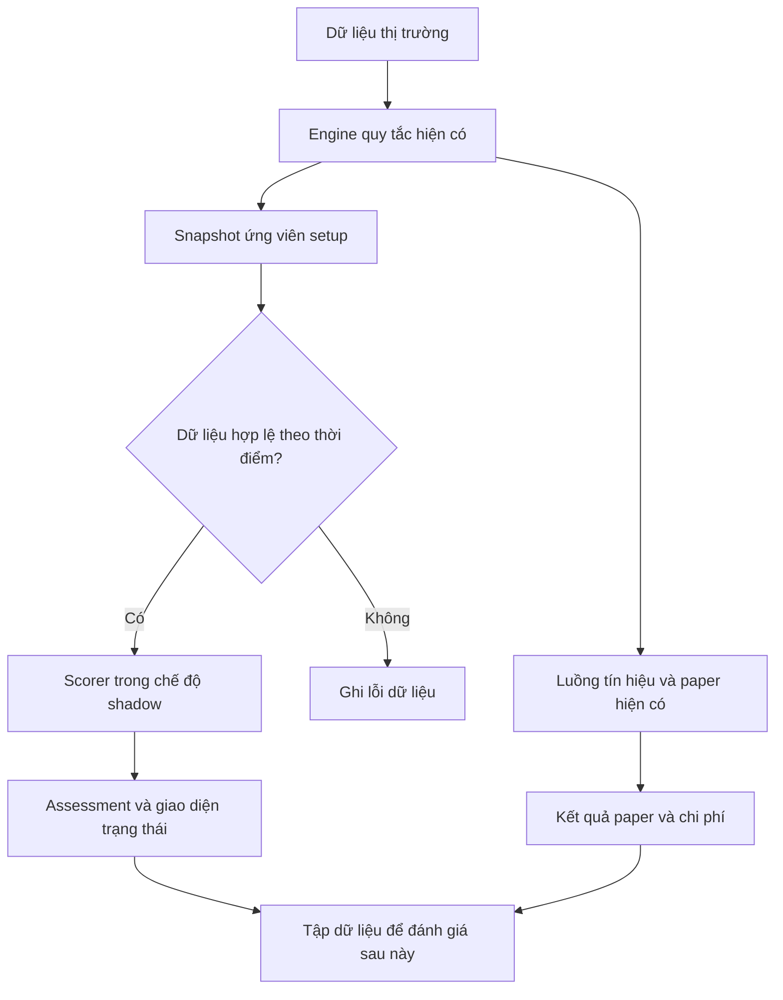

# Mr.Bit — Tích hợp mạng nơ-ron: đầu vào cho phiên coding 01

> [Inference] Đây là đặc tả triển khai đề xuất, tổng hợp từ hai ảnh người dùng cung cấp và phân tích trong cuộc trò chuyện. Chưa kiểm tra mã nguồn dự án, dữ liệu thị trường, kết nối sàn hoặc hiệu quả giao dịch. Mọi tên tệp, interface và cấu hình bên dưới là đề xuất để ánh xạ vào repository thực tế.

- Ngày biên soạn: **30/09/2026**, múi giờ người dùng **Asia/Ho_Chi_Minh**.
- Phiên bản tài liệu: **1.0**.
- Phạm vi: **hệ thống phân tích giao dịch crypto/SMC trong ảnh**, không phải dự án MMO/TikTok.
- Trạng thái: **sẵn sàng làm brief cho coding; chưa triển khai, chưa huấn luyện mô hình**.
- Đầu vào đã quan sát: `image(2).png` — trang Kiến thức và quy trình giao dịch; `image(3).png` — công cụ, quản trị, phiên giao dịch.
- Đầu vào còn thiếu: repository, cấu hình chiến lược thực, dữ liệu tín hiệu, dữ liệu khớp lệnh và kết quả kiểm thử.

## 0. Cách dùng ngay trong phiên coding

1. Đặt tài liệu này trong thư mục tài liệu của repository, ví dụ `docs/MRBIT_NEURAL_CODING_01.md`.
2. Mở coding agent tại đúng repository và gửi prompt ở phần cuối.
3. Yêu cầu agent bắt đầu bằng kiểm tra repository và ánh xạ yêu cầu vào code hiện có.
4. Hoàn thành các mục **P0** trước; các mục **P1/P2** là lộ trình tiếp theo.

**Kết quả cần có của phiên đầu:** một luồng tích hợp chạy được trong môi trường phát triển, nhận setup từ engine hiện tại, tạo snapshot dữ liệu đúng thời điểm, lưu nhật ký và trả trạng thái đánh giá trung thực. Khi chưa có mô hình, đầu ra phải là `not_trained` với xác suất `null`.

**Chế độ đầu tiên là shadow:** mô-đun mới quan sát và ghi kết quả thử; không tham gia quyết định đặt lệnh thật. Đây là lựa chọn phạm vi cho mô-đun mới, không phải yêu cầu vô hiệu hóa các chức năng sẵn có của dự án.

---

## 1. Quy ước về bằng chứng

| Nhãn | Ý nghĩa |
| --- | --- |
| Quan sát từ ảnh | Văn bản giao diện đã nhìn thấy; chưa xác minh implementation tương ứng. |
| Đề xuất | Thiết kế cần kiểm tra tính tương thích khi tích hợp. |
| Cần kiểm tra code | Không quyết định chỉ bằng suy luận từ giao diện. |
| Chưa xác minh | Chưa có dữ liệu để kết luận; giữ trạng thái này trong báo cáo. |

Các ngưỡng trong ảnh là **tham số được mô tả**, không phải ngưỡng đã được chứng minh hiệu quả hoặc khuyến nghị quản lý vốn cá nhân. Không tự sửa chiến lược dựa vào tài liệu này.

Nếu bổ sung LLM để đọc tài liệu hoặc giải thích kết quả: [Inference] khả năng đó được đề xuất dựa trên mẫu hoạt động quan sát được của LLM; phần tính điểm, tính tiền và kiểm tra điều kiện phải có kết quả chương trình làm căn cứ. LLM không cần thiết cho phạm vi P0.

## 2. Hiện trạng cần đối chiếu với repository

| ID | Quan sát từ ảnh | Việc phải tìm trong code |
| --- | --- | --- |
| R01 | Bias khung 4H; mô tả chỉ tìm setup thuận chiều khung lớn. | Hàm xác định xu hướng, cách nhận diện swing và bộ lọc hướng lệnh. |
| R02 | Đánh giá đồng thuận 4H/1H/15m; có điểm trừ khi ngược khung. | Xác định quan hệ giữa bộ lọc cứng và điều kiện chỉ trừ điểm. |
| R03 | BOS/CHoCH; xác nhận theo thân nến, sweep và các điều kiện khác. | Định nghĩa từng sự kiện và thời điểm sự kiện thực sự được biết. |
| R04 | Checklist cộng/trừ điểm; ngưỡng kích hoạt quanh 70; có điểm phiên. | So sánh `>` hay `>=`; giới hạn tổng điểm; các thành phần và thứ tự tính. |
| R05 | Order Block: impulse tối thiểu 1,35 ATR; gần BOS/CHoCH trong 12 nến. | Impulse tính theo thân, biên hay cả nhịp? ATR trên khung nào, chu kỳ nào? |
| R06 | OB có xét quét thanh khoản, cùng xu hướng, tuổi và số lần chạm. | Định nghĩa OB, ranh giới vùng, mitigation, invalidation, đếm lần chạm. |
| R07 | FVG chưa lấp quá 50%; công cụ Premium/Discount và Fibonacci OTE. | Chiều đo phần trăm, biên tham chiếu, quy tắc cập nhật và vô hiệu hóa. |
| R08 | Pinbar, nhấn chìm, doji/inside bar được đánh giá theo bối cảnh. | Công thức tỷ lệ thân/râu và nơi tín hiệu được cộng hoặc trừ điểm. |
| R09 | Breakout thật/giả; sweep dựa vào wick vượt vùng và close quay lại. | Phân biệt sự kiện hiện tại với kết quả chỉ biết sau nhiều nến. |
| R10 | Volume Profile, RSI, EMA200, funding và dữ liệu top trader. | Nguồn dữ liệu, timestamp, cách chuẩn hóa, trường thiếu và độ trễ. |
| R11 | Wait → Watch → Confirm → Execute → Forget. | State machine hiện có; điều kiện chuyển, hết hạn, hủy và chống lặp. |
| R12 | Paper bot dời SL về giá vào tại +1R; trailing/thoát theo nến còn được mô tả là chưa tự động hóa. | Policy đang thực thi thật; không suy ra toàn bộ quản lý lệnh đã hoạt động. |
| R13 | Rủi ro 1–2% mỗi lệnh, RR tối thiểu 1:2, ngắt theo lỗ ngày 3–5%. | Đây là text hướng dẫn hay cấu hình thực thi? Cơ sở vốn, phí, lỗ mở và rủi ro đồng thời được tính thế nào? |
| R14 | Các khung giờ Tokyo/London/New York và giờ giao thoa. | Dùng UTC hay giờ địa phương; cách xử lý DST; cửa sổ qua nửa đêm. |

Không coi đèn trạng thái Binance/OKX/MEXC trong ảnh là bằng chứng kết nối thành công. Không diễn giải tên tài liệu “18 phút” thành khung nến 18 phút nếu code không quy định như vậy.

## 3. Các quyết định cần chốt bằng code hoặc cấu hình

| Vấn đề | Hướng xử lý trong phiên 01 |
| --- | --- |
| Thuận 4H là điều kiện bắt buộc hay ưu tiên mềm? | Ghi nhận hành vi hiện có; tách `rule_eligibility` khỏi `rule_score`. Nếu text và code khác nhau, báo rõ, chưa tự thay đổi. |
| Điểm 70 có ý nghĩa gì? | Giữ dưới tên điểm quy tắc. Không đổi sang xác suất thắng. |
| Nhiều chỉ báo cùng phản ánh xu hướng | Lưu thành phần riêng để sau này thử bỏ từng nhóm biến; chưa tự điều chỉnh trọng số. |
| “Smart Money luôn quét” / “Futures điều khiển Spot” | Không dùng như nhãn sự thật. Chuyển thành sự kiện giá/khối lượng/phái sinh quan sát được. |
| Phiên theo giờ Việt Nam cố định | Ghi rõ định nghĩa hiện hành. Nếu bám giờ London/New York, chuyển theo múi giờ và ngày [S7][S8]. |
| Hòa vốn tại giá vào | Gọi đúng là stop tại giá vào; PnL ròng vẫn tính phí, funding và trượt giá [S6]. |
| Chưa có nhãn hoặc mô hình | Hoàn thành luồng ghi dữ liệu và scorer `not_trained`; không tạo xác suất minh họa trên giao diện vận hành. |

Các điểm chưa rõ về công thức có thể để `null` kèm lý do trong mô-đun mới. Điều này không chặn việc làm adapter, persistence, trạng thái UI và các kiểm thử hợp đồng.

## 4. Phạm vi phiên coding 01

### P0 — Phải hoàn thành

- [ ] Kiểm tra hướng dẫn repository, trạng thái git, stack, scripts, test và dữ liệu hiện có.
- [ ] Tìm đường đi của dữ liệu: feed → candle → feature → rule score → signal → paper/execution.
- [ ] Thêm feature flag `off | shadow` theo cơ chế cấu hình của dự án.
- [ ] Tạo adapter nhận ứng viên setup tại điểm phù hợp, gồm cả ứng viên dưới ngưỡng điểm nếu engine có cung cấp.
- [ ] Tạo snapshot có version, nguồn và thời gian khả dụng của dữ liệu.
- [ ] Tạo feature registry; chỉ bật feature đã có định nghĩa kiểm chứng được trong code.
- [ ] Tạo interface scorer và implementation `NotTrainedScorer`.
- [ ] Lưu setup, thành phần điểm và assessment với cơ chế chống ghi trùng.
- [ ] Hiển thị trạng thái dữ liệu/mô hình trong màn hình hiện có hoặc trang phát triển nhỏ.
- [ ] Bổ sung các kiểm thử có ý nghĩa ở phần 12; chạy build/lint/test theo repository.
- [ ] Viết ghi chú cách bật shadow, xem log, tắt mô-đun và những phần còn thiếu.

### P1 — Sau khi P0 ổn định và có dữ liệu

- Hoàn thiện replay/paper outcome recorder theo policy thực tế.
- Tạo bộ dữ liệu từ snapshot và kết quả sau đó, có kiểm tra thời gian và nhãn chồng lấn.
- Huấn luyện baseline đơn giản và MLP nhỏ; đánh giá ngoài mẫu.
- Tích hợp artifact mô hình đã qua kiểm tra tương thích ở chế độ shadow.

### P2 — Chỉ khi thử nghiệm chứng minh có ích

- Mô hình chuỗi TCN/LSTM; dữ liệu sổ lệnh nếu có khả năng thu thập và tái hiện.
- Hiệu chuẩn xác suất, theo dõi thay đổi phân phối, so sánh champion/challenger.
- Quy trình xét chuyển từ shadow sang hỗ trợ quyết định; đây là phạm vi riêng, không thuộc phiên 01.

## 5. Kiến trúc tích hợp



Trong P0 không có đường nối từ scorer sang order router. Scorer có lỗi phải tạo assessment lỗi; không đổi lỗi thành điểm 0 hay xác suất 50%.

Tái sử dụng tổ chức dự án. Không tạo thêm backend, service Python, vector database hoặc message broker chỉ vì có chữ “AI”. Nếu hiện tại chỉ có frontend, cần xác định nơi lưu dữ liệu và chạy xử lý tin cậy trước khi thiết kế một dịch vụ mới.

## 6. Hợp đồng dữ liệu

### 6.1 Quy ước chung

- Timestamp lưu UTC theo một quy ước thống nhất của dự án; các ví dụ dưới đây dùng RFC3339 với `Z`.
- Phân biệt `event_time`, `available_at` và `generated_at`; thời gian giá phát sinh không đồng nghĩa thời gian app nhận được.
- `as_of` là thời điểm chốt thông tin đầu vào cho một assessment.
- Giá, số lượng và tiền dùng kiểu decimal theo conventions hiện có; không mặc định số hợp đồng bằng số coin.
- Feature số thực phải hữu hạn; giá trị thiếu dùng `null` kèm lý do, không tự chuyển thành `0`.
- Chỉ chuẩn hóa theo tham số đã fit trên tập huấn luyện, không fit trên toàn bộ dữ liệu.
- Ghi `strategy_version`, `feature_version`, `execution_policy_version`, `schema_version` độc lập.
- Phân biệt `synthetic_fixture`, `historical_replay`, `paper_observed` và dữ liệu vận hành. Fixture không được lẫn vào thống kê hiệu quả thực.

### 6.2 Candle đầu vào

| Trường | Ý nghĩa |
| --- | --- |
| `venue`, `instrument`, `market_type` | Sàn, mã, spot/perpetual/loại hợp đồng. |
| `timeframe`, `open_time`, `close_time` | Định nghĩa khung và ranh giới thời gian. |
| `available_at`, `is_closed` | Lúc hệ thống biết bản ghi; trạng thái hoàn thành. |
| `open`, `high`, `low`, `close` | Giá có kiểu dữ liệu nhất quán. |
| `volume`, `volume_unit` | Khối lượng và đơn vị; có thể khác giữa spot và phái sinh. |
| `source`, `quality_flags` | Nguồn, mất nến, trùng nến, backfill, trễ, dữ liệu sửa lại. |

OKX có trường `confirm` phân biệt nến chưa/đã hoàn thành [S1]. Adapter của sàn khác phải ánh xạ theo tài liệu tương ứng, không giả định tên trường giống nhau.

Nếu dữ liệu lịch sử không có thời gian khả dụng thực, ghi rõ giả định replay trong provenance. Không điền một timestamp giả rồi gọi là dữ liệu quan sát trực tiếp.

### 6.3 Setup snapshot

| Nhóm | Trường cần lưu |
| --- | --- |
| Danh tính | `setup_id`, `dedup_key`, `schema_version`, nguồn dữ liệu. |
| Thời gian | `as_of`, `generated_at`, thời điểm trigger được xác nhận. |
| Thị trường | Sàn, mã, loại sản phẩm, hướng `long/short`, loại setup. |
| Quy tắc | `strategy_version`, `rule_eligibility`, `rule_score`, `rule_components`, lý do bị loại. |
| Feature | `feature_version`, giá trị, mask thiếu, quality flags, tham chiếu input. |
| Kế hoạch | Policy vào lệnh, stop ban đầu, mục tiêu, hết hạn entry, thời gian giữ tối đa. |
| Thoát lệnh | `execution_policy_version`, BE/trailing/chốt từng phần nếu có. |
| Truy vết | Phiên bản code, config hash, input hash theo cơ chế của dự án. |

Snapshot dùng cho một dự báo là bất biến. Những diễn biến mới tạo sự kiện hoặc snapshot phiên bản mới; không sửa ngược đặc trưng của dự báo cũ sau khi biết kết quả.

### 6.4 Assessment

| Trường | Quy định |
| --- | --- |
| `status` | Một trong `disabled`, `not_trained`, `insufficient_data`, `invalid_data`, `incompatible_model`, `ready`, `error`. |
| `mode` | P0 chỉ nhận `off` hoặc `shadow`. |
| `model_version` | `null` khi không có artifact mô hình. |
| `prediction_as_of` | Thời điểm thông tin mà dự báo sử dụng. |
| `p_net_positive` | `null` khi không có dự báo hợp lệ; khi có phải trong [0,1]. |
| `expected_net_r` | `null` nếu model không có đầu ra này; không suy ra bằng một công thức RR cố định khi có thoát động. |
| `uncertainty` | Có phương pháp ước lượng thì ghi rõ; nếu chưa triển khai, để `null`. |
| `calibration_status` | `not_applicable`, `not_evaluated` hoặc metadata của lần hiệu chuẩn. |
| `reason_codes` | Mã nguyên nhân xác định được bằng chương trình. |
| `feature_version`, `latency_ms` | Tương thích input và thời gian chạy đo thực. |

`ready` chỉ có nghĩa suy luận thành công và đầu vào tương thích; không có nghĩa mô hình có lợi nhuận hoặc đủ điều kiện giao dịch thật. Điểm quy tắc hiển thị riêng với đầu ra mô hình.

### 6.5 Ví dụ hợp đồng — fixture hư cấu

Ví dụ này dùng để thử luồng dữ liệu; không phải tín hiệu thị trường. Tên mã và thời gian đều là dữ liệu fixture.

```json
{
  "schema_version": "1.0",
  "setup_id": "fixture-setup-001",
  "data_origin": "synthetic_fixture",
  "venue": "FIXTURE",
  "instrument": "TEST-PERP",
  "market_type": "perpetual",
  "side": "long",
  "as_of": "2026-09-30T12:00:00Z",
  "generated_at": "2026-09-30T12:00:01Z",
  "strategy_version": "fixture-v0",
  "execution_policy_version": "unresolved",
  "rules": {
    "eligibility": "unknown",
    "score": null,
    "score_kind": "heuristic",
    "components": []
  },
  "features": {
    "version": "features-v0",
    "values": {},
    "missing": ["market_history"],
    "quality_flags": ["synthetic_fixture"]
  },
  "assessment": {
    "status": "not_trained",
    "mode": "shadow",
    "prediction_as_of": "2026-09-30T12:00:00Z",
    "model_version": null,
    "p_net_positive": null,
    "expected_net_r": null,
    "uncertainty": null,
    "calibration_status": "not_applicable",
    "reason_codes": ["MODEL_NOT_AVAILABLE"]
  }
}
```

Không buộc giao diện dùng đúng cấu trúc lồng này nếu repository có contract phù hợp; giữ nguyên ý nghĩa và quy tắc `null/status` khi ánh xạ.

## 7. Feature registry phiên đầu

| Nhóm | Feature ứng viên | Điều kiện/cách tính cần thống nhất |
| --- | --- | --- |
| Cấu trúc | `trend_4h`, `trend_1h`, `trend_15m` | Lấy từ engine và lưu thời điểm xác nhận; không tự đổi định nghĩa swing. |
| Sự kiện | `bars_since_bos`, `bars_since_choch` | Đếm từ thời điểm đã biết sự kiện trên đúng khung. |
| Vị trí | `distance_to_poi_atr`, `distance_to_swing_atr` | Ghi ATR thuộc khung/chu kỳ nào; mẫu số không hợp lệ thì thiếu dữ liệu. |
| Nến | `body_range_ratio`, `upper_wick_ratio`, `lower_wick_ratio` | Với nến đã đóng; high = low thì ratio là `null` với lý do. |
| Volume | `relative_volume` | Đề xuất: volume hiện tại / trung bình cửa sổ nến trước đó; version hóa cửa sổ và đơn vị. |
| OB | `ob_age_bars`, `ob_touch_count`, `ob_impulse_atr` | Không tính impulse/mitigation nếu chưa xác định công thức từ code. |
| FVG | `fvg_width_atr`, `fvg_fill_ratio` | Quy ước hướng, ranh giới và thời điểm hình thành phải rõ. |
| Sweep | `sweep_depth_atr`, `close_back_inside`, `bars_since_sweep` | Phân biệt lúc giá vượt vùng với lúc nến đóng xác nhận quay lại. |
| Phái sinh | `funding_rate`, `oi_change`, tỷ lệ vị thế nếu có | Dữ liệu phải được công bố/nhận trước `as_of`; lưu nguồn và freshness. |
| Phiên | Phiên theo múi giờ, thời điểm trong ngày | Chuyển theo ngày; xử lý phiên qua nửa đêm và DST. |
| Chất lượng | Missing mask, độ trễ và khoảng trống dữ liệu | Không để imputer che giấu lỗi feed; thiếu dữ liệu bắt buộc thì chưa dự báo. |

Không cần triển khai mọi feature ở P0. Ưu tiên tái sử dụng các biến engine đã tính đúng và có thể kiểm tra được. Bảng trên là danh sách ứng viên, không phải kết quả chứng minh giá trị dự báo.

### Quy tắc chống nhìn trước tương lai

1. Mỗi input dùng cho dự báo phải khả dụng tại `as_of`.
2. Nếu chính sách dùng nến đóng, không dùng nến đang hình thành trên bất kỳ khung nào.
3. Khi nối 5m/15m/1H/4H, dùng bản ghi khung lớn đã đủ điều kiện tại thời điểm đó; không join bằng ngày rồi lấy close cuối ngày.
4. Swing cần nến bên phải chỉ được phát tín hiệu sau khi đủ nến xác nhận; giữ riêng thời gian pivot và thời gian phát hiện.
5. Không dùng volume tổng phiên, đỉnh/đáy cuối ngày, retest tương lai hoặc nhãn breakout thành công làm feature tại thời điểm chưa biết.
6. Input snapshot của một dự báo không được sửa bằng các giá trị tính lại với dữ liệu tương lai.

## 8. Scorer và vị trí tích hợp

Tên dưới đây mô tả trách nhiệm, không ấn định framework hay ngôn ngữ:

| Thành phần | Trách nhiệm |
| --- | --- |
| `SetupAdapter` | Nhận ứng viên từ engine; ánh xạ điểm/quy tắc/thời gian. |
| `FeatureBuilder` | Xây feature đúng cutoff; báo thiếu dữ liệu và provenance. |
| `SetupScorer` | Hợp đồng đánh giá snapshot, không có khả năng gọi order API. |
| `NotTrainedScorer` | Trả trạng thái chưa có mô hình với các đầu ra dự báo `null`. |
| `AssessmentRepository` | Ghi snapshot/assessment, chống trùng và truy vấn có giới hạn. |
| `OutcomeRecorder` | Gắn kết quả paper đã chốt với setup gốc ở giai đoạn tiếp theo. |

Luồng điều phối đề xuất:

```text
handle_candidate(candidate):
    nếu mode = off: kết thúc nhánh neural
    tạo/nhận setup_id ổn định
    lưu snapshot quy tắc và provenance
    nếu dữ liệu không hợp lệ: lưu assessment lỗi dữ liệu; kết thúc
    nếu chưa có mô hình: lưu assessment not_trained; kết thúc
    nếu artifact không tương thích: lưu incompatible_model; kết thúc
    tạo feature đúng cutoff
    nếu thiếu input bắt buộc: lưu insufficient_data; kết thúc
    chạy scorer với giới hạn thời gian theo cấu hình
    kiểm tra schema/range/finiteness của đầu ra
    lưu assessment; không gọi order router
```

Thứ tự ưu tiên lỗi phải thống nhất trong implementation. Ví dụ fixture chưa có dữ liệu và chưa có mô hình có thể báo `not_trained`; tất cả lý do phụ vẫn được lưu. Dữ liệu sai cấu trúc phải bị từ chối trước suy luận.

### Ghi dữ liệu và khả năng phục hồi

- Tái sử dụng DB/event store/queue có sẵn; migration mới phải bổ sung, có kế hoạch rollback.
- Dedup key dựa trên danh tính setup, không chỉ dựa vào giá hoặc điểm. Ví dụ các thành phần: strategy version, sàn, sản phẩm, mã, hướng, trigger đã xác nhận, loại setup và POI ID.
- Poll lại cùng sự kiện không tạo thêm giao dịch/ứng viên độc lập trong tập học.
- Nếu setup có cập nhật hoặc bị hủy, lưu event hoặc revision; không ghi đè snapshot đã dự báo.
- Có giới hạn hàng đợi/bộ nhớ, chính sách retry và ghi nhận bản ghi bị mất nếu persistence thất bại. Không chặn vô hạn luồng tín hiệu hiện có.
- Dùng cơ chế lỗi và timeout của dự án; không tự ấn định con số latency chưa đo.

### Artifact mô hình ở P1

Metadata tối thiểu: model version, feature version và thứ tự cột, danh mục mã hóa, scaler/imputer, định nghĩa target, execution policy version, thời gian train/calibration/test, cấu hình, seed, số mẫu theo lớp/giai đoạn, metrics, checksum và phiên bản code.

Runtime từ chối artifact sai thứ tự cột, sai feature version hoặc policy không tương thích. Huấn luyện thực hiện ngoài đường xử lý tín hiệu; không tự học trực tuyến và thay model trong phiên 01.

## 9. Outcome và nhãn học ở giai đoạn tiếp theo

### Định nghĩa kết quả

Target đề xuất: kết quả ròng của một setup theo **policy vào/thoát lệnh đã khóa trước**, trong thời gian theo dõi đã quy định.

Các trạng thái cần phân biệt:

- `unfilled`: chưa khớp đến lúc hết hạn entry; không tự coi là lệnh thua.
- `open`: còn đang theo dõi; chưa có nhãn hoàn tất.
- `closed`: đã khớp và đã thoát toàn bộ; có kết quả ròng.
- `ambiguous`: không xác định được thứ tự khớp từ độ phân giải dữ liệu.
- `invalid`: lỗi dữ liệu hoặc không thể mô phỏng theo hợp đồng đã chọn.

Lý do đóng có thể gồm TP, SL, stop tại giá vào, trailing, chốt thủ công hoặc hết thời gian. Với chốt từng phần, phải tổng hợp toàn bộ fills và chi phí của vị thế.

### Công thức R

```text
net_pnl = realized_gross_pnl - trading_fees + net_funding_cashflow
net_R   = net_pnl / initial_risk_amount
```

- Giá thực thi/mô phỏng đã phản ánh trượt giá thì không trừ trượt giá thêm lần nữa.
- Nếu dùng giá lý tưởng, phải có mô hình chi phí thực thi riêng và tránh đếm phí trùng.
- `initial_risk_amount` được chốt theo entry thực tế/mô phỏng đã khớp, stop ban đầu, số lượng và đặc tả hợp đồng; không đổi mẫu số khi dời SL.
- Mẫu số không dương hoặc không xác định thì không tạo nhãn `net_R` hợp lệ.
- PnL phải tính theo adapter sản phẩm: hợp đồng linear, inverse, multiplier và đơn vị khối lượng không mặc định giống nhau.
- Thanh lý, mark price và thiếu ký quỹ cần được mô phỏng nếu phạm vi hỗ trợ sản phẩm/đòn bẩy đó; không giả định stop luôn khớp ở mức đặt.

Target phân loại đề xuất: `net_R > 0` cho các lệnh đóng hợp lệ, đi kèm target hồi quy `net_R` nếu mô hình có hỗ trợ. Không dùng nhãn OB khỏe/yếu do engine tự chấm thay cho kết quả kinh tế.

### Điều kiện tạo nhãn

1. Khóa hướng, policy entry, stop, mục tiêu, BE/trailing, phí và thời gian giữ trước khi nhìn phần dữ liệu tương lai.
2. Tín hiệu xác nhận ở close không mặc nhiên khớp đúng close đó; mô phỏng lần thực thi khả thi tiếp theo.
3. Nếu cùng một nến chạm cả stop và TP, dùng dữ liệu chi tiết hơn; nếu không có, đánh dấu mơ hồ. Một giả định bảo thủ dùng cho kiểm tra độ nhạy phải được ghi rõ, không gọi là khớp thực.
4. BE và trailing phải được xử lý theo đúng thứ tự sự kiện; không kích hoạt dời stop bằng high tương lai rồi bỏ qua low xảy ra trước đó.
5. Hết thời gian mà policy không yêu cầu thoát thì vị thế còn mở/censored, không tự tạo kết quả đóng.
6. Báo cáo tỷ lệ mẫu bị loại/mơ hồ; không âm thầm chỉ giữ các mẫu dễ mô phỏng.

## 10. Thử nghiệm mô hình sau phiên 01

### Baseline và mô hình

So sánh trên cùng tập kiểm tra và cách tính chi phí:

1. Engine quy tắc hiện tại, giữ đúng hành vi đã ghi nhận.
2. Mô hình đơn giản như logistic regression dùng cùng feature.
3. MLP nhỏ cho dữ liệu bảng; TCN/LSTM là thử nghiệm mở rộng khi có chuỗi đủ chất lượng.

[Inference] Chưa có bằng chứng mạng nơ-ron sẽ vượt baseline trong dự án này. TCN là nguồn nghiên cứu mô hình chuỗi [S9]; DeepLOB nghiên cứu dữ liệu sổ lệnh, không phải chứng minh cho chiến lược SMC/crypto hiện tại [S10].

### Thiết kế chia tập

- Tách train → validation/calibration → test theo thời gian; test cuối giữ nguyên đến khi chốt lựa chọn.
- Với dữ liệu nhiều mã, tách theo thời gian toàn thị trường, không vô tình đưa thời điểm tương lai của mã này vào train khi test quá khứ của mã khác.
- Fit scaler/imputer/feature selection trên train của từng fold.
- Loại các mẫu train có khoảng thời gian nhãn chồng lên validation/test. Khoảng cách `gap` đơn thuần theo số dòng chưa tự giải quyết mọi nhãn có độ dài biến thiên [S2].
- Dùng nhóm theo setup/sự kiện khi nhiều bản ghi xuất phát từ một sự kiện; không chia các bản sao sang hai tập.
- Chọn threshold bằng validation, không chọn sau khi xem kết quả test.
- Ghi tổng số cấu hình đã thử; tránh chỉ báo cáo cấu hình tốt nhất [S4].

### Metrics và điều kiện xem xét

| Mặt đánh giá | Chỉ số cần báo cáo |
| --- | --- |
| Kết quả kinh tế | Net R trung bình, net PnL, drawdown, chi phí, số lệnh và turnover. |
| Phân loại | Precision/recall theo target; phân bố lớp; không dùng accuracy đơn lẻ. |
| Xác suất | Log loss/Brier score cùng reliability diagram và số mẫu mỗi nhóm [S3]. |
| Tính ổn định | Theo mã, chiều lệnh, giai đoạn, mức biến động và chính sách thực thi. |
| Hệ thống | Độ trễ, lỗi feed, missing features, tỷ lệ chưa dự báo, tỷ lệ khớp mô phỏng. |

Không có ngưỡng win rate, sample size hoặc lợi nhuận “đạt chuẩn” được xác minh cho dự án. Chốt tiêu chí nghiên cứu trước khi chạy; báo số mẫu và độ bất định. Kết quả test tốt chưa phải phê duyệt đặt lệnh thật.

## 11. Giao diện cần cho P0

Đề xuất thêm một khu vực nhỏ vào màn hình tín hiệu hiện có:

| Nội dung | Cách hiển thị |
| --- | --- |
| Điểm quy tắc | Giá trị hiện có, ghi rõ “điểm quy tắc”. |
| Trạng thái đánh giá | “Đang tắt”, “Chưa huấn luyện”, “Thiếu dữ liệu”, “Lỗi dữ liệu” hoặc trạng thái tương ứng. |
| Chế độ | “Theo dõi thử / shadow”. |
| Xác suất | Dấu gạch hoặc “Chưa có dự báo” khi `null`; không vẽ thanh xác suất giả. |
| Dữ liệu | Thời điểm cập nhật, trạng thái thiếu/trễ và lý do có ý nghĩa với người dùng. |
| Giải thích | Nguyên nhân dựa trên dữ liệu/rule có thật. Không tạo câu giải thích nhân quả bằng cách suy đoán. |

Thông tin version/hash/stack chi tiết đặt trong màn hình chẩn đoán hoặc log dành cho người phát triển. Fixture phải có nhãn “dữ liệu thử”; không gộp vào bảng thành tích của chiến lược.

## 12. Kiểm thử nghiệm thu có ý nghĩa

Đây là các kiểm thử cần viết khi code mô-đun, không phải xác nhận rằng hệ thống hiện đã vượt qua.

| ID | Tình huống | Kết quả mong đợi |
| --- | --- | --- |
| T01 | Feature flag tắt. | Luồng mới không hoạt động; tín hiệu cũ khớp baseline trên cùng fixture. |
| T02 | Shadow bật, chưa có model. | Assessment `not_trained`; dự báo `null`; không phát sinh lời gọi order API từ mô-đun. |
| T03 | Nến khung lớn chưa đóng hoặc input có `available_at > as_of`. | Không được sử dụng cho dự báo theo policy nến đóng. |
| T04 | Thay đổi mọi dữ liệu sau cutoff rồi replay prefix. | Snapshot/feature/dự báo trước cutoff không thay đổi. |
| T05 | Pivot cần nến xác nhận bên phải. | Thời điểm signal là khi đủ xác nhận, không phải thời điểm pivot trong quá khứ. |
| T06 | Feed thiếu/trễ, high = low, NaN/Infinity, sai đơn vị volume. | Trạng thái hoặc missing flag rõ; không tạo số giả hợp lệ. |
| T07 | Sự kiện được gửi lại sau reconnect/retry. | Không nhân đôi setup hay kết quả thống kê. |
| T08 | Scorer timeout/lỗi/persistence lỗi. | Có log và cách phục hồi theo policy; không thay đổi quyết định của engine gốc. |
| T09 | Model sai feature version/thứ tự cột. | Bị từ chối với `incompatible_model`. Có thể kiểm hợp đồng bằng test double được đánh dấu. |
| T10 | BE tại giá vào, có phí. | Outcome ròng tính đúng; không tự gắn bằng 0R. Thuộc P1 nếu P0 chưa có outcome. |
| T11 | Một nến chạm cả stop/TP hoặc vừa +1R vừa stop. | Không chọn thứ tự có lợi thiếu căn cứ; báo mơ hồ hoặc dùng dữ liệu chi tiết. |
| T12 | Qua ngày chuyển DST và qua nửa đêm. | Session map nhất quán với định nghĩa múi giờ đã chốt. |
| T13 | UI nhận dự báo `null` hoặc `error`. | Không hiển thị 0%, 50%, 100% hoặc nhãn “AI xác nhận” giả. |
| T14 | Xóa/tắt cấu hình shadow. | Có thể quay về trạng thái trước tích hợp bằng cách tắt mô-đun; dữ liệu cũ không bị phá hủy. |

Test double chỉ phục vụ kiểm tra hợp đồng, không được đóng gói như model đã huấn luyện. Không đặt pass rate hoặc kết quả build khi chưa chạy.

## 13. Trình tự coding và ánh xạ tệp

### Bước 1 — Khảo sát repository

- Đọc `AGENTS.md` và các hướng dẫn áp dụng; kiểm tra git status và thay đổi của người dùng.
- Xác định package manager từ lockfile, framework, storage, migrations, scripts test/build.
- Tìm engine, connector dữ liệu, timer/WebSocket, state machine, risk checks, paper bot và UI tín hiệu.
- Tạo bảng ánh xạ: yêu cầu → tệp/hàm thực → thay đổi dự kiến → kiểm thử.

Lệnh tham khảo chỉ đọc; điều chỉnh nếu công cụ không có:

```bash
git status --short
rg --files -g AGENTS.md -g package.json -g pyproject.toml -g '*lock*' -g 'README*'
rg -n --glob '!*.lock' --glob '!node_modules/**' --glob '!dist/**' 'BOS|CHoCH|ATR|funding|paper|break.?even|order.?block' .
```

Nếu không có repository, báo thiếu đầu vào; không tạo một app mới rồi mô tả là đã tích hợp dự án hiện có.

### Bước 2 — Ánh xạ vào tổ chức hiện tại

Các tên logic đề xuất, không bắt buộc tạo đúng thư mục:

| Tệp/mô-đun logic | Nội dung |
| --- | --- |
| `neural/contracts` | Schema snapshot, assessment và trạng thái. |
| `neural/features` | Registry, feature builder và kiểm tra cutoff. |
| `neural/scorer` | Interface cùng `NotTrainedScorer`. |
| `neural/observer` | Adapter sự kiện và điều phối shadow. |
| `neural/repository` | Persistence, dedup và truy vấn. |
| UI tín hiệu hiện có | Khu vực trạng thái, dữ liệu thiếu và dự báo nullable. |
| Test theo conventions repo | Kiểm thử chống nhìn trước, lỗi và regression. |
| Tài liệu tích hợp | Hướng dẫn bật/tắt, schema, giới hạn và việc còn lại. |

### Bước 3 — Build tăng dần

1. Làm contract và flag; kiểm tra đường đi khi `off`.
2. Làm adapter + persistence với fixture có nhãn; kiểm tra dedup.
3. Thêm feature đã định nghĩa được và kiểm tra thời gian.
4. Nối `NotTrainedScorer`, kiểm tra trạng thái nullable.
5. Thêm UI tối thiểu và xử lý lỗi.
6. Chạy kiểm thử tập trung, regression liên quan và build chính thức của repository.
7. Báo cáo tệp thay đổi, lệnh thực đã chạy, kết quả, rủi ro còn lại và cách tắt tính năng.

Không tự giả định lệnh `npm run build` hoặc `pytest` tồn tại. Không thay package manager, nâng dependency hàng loạt hoặc viết lại engine nếu không có nguyên nhân từ yêu cầu này.

## 14. Definition of Done cho phiên 01

- [ ] Có bảng ánh xạ vào tệp/hàm thật và danh sách điểm chưa xác minh.
- [ ] Build hiện có chạy được, hoặc báo đúng blocker có bằng chứng.
- [ ] `off/shadow` có hành vi kiểm tra được; mặc định và cách bật được ghi rõ.
- [ ] Setup snapshot và assessment được lưu, có version/provenance/dedup.
- [ ] Một luồng từ fixture/sự kiện qua adapter đến UI được chứng minh bằng log hoặc kiểm thử.
- [ ] Không có model thì UI và API trả trạng thái chưa huấn luyện, không có số dự báo giả.
- [ ] Kiểm thử cutoff, dữ liệu thiếu, dedup, lỗi và regression liên quan đã chạy.
- [ ] Các sửa đổi và migration có cách quay lui phù hợp; không xóa dữ liệu người dùng.
- [ ] Không có bằng chứng build/test bị diễn giải thành bằng chứng lợi nhuận.
- [ ] Bàn giao rõ P0 đã làm, P0 còn thiếu, P1/P2 chưa thực hiện.

## 15. Prompt giao cho coding agent

Sao chép khối sau trong phiên có quyền truy cập repository:

```text
Đọc MRBIT_NEURAL_CODING_01.md và tích hợp phạm vi P0 vào dự án Mr.Bit hiện có.

Bắt đầu bằng việc đọc hướng dẫn repository, git status, package/lockfile,
scripts và đường đi của engine dữ liệu → quy tắc → tín hiệu → paper/execution.
Lập bảng ánh xạ yêu cầu vào tệp/hàm thực. Không coi ảnh giao diện là bằng chứng
một chức năng backend đã hoạt động.

Triển khai tăng dần: feature flag off/shadow, adapter setup, snapshot đúng
thời điểm, feature registry, persistence có dedup, interface scorer,
NotTrainedScorer và khu vực trạng thái trong UI hiện có. Tái sử dụng stack,
storage, conventions và error handling của repository.

Shadow chỉ quan sát và ghi đánh giá; mô-đun mới không gọi order router.
Giữ rõ điểm quy tắc và xác suất mô hình. Nếu chưa có artifact đã huấn luyện,
trả not_trained và các dự báo null. Fixture/test double phải được đánh dấu.

Kiểm tra dữ liệu tương lai, nến chưa đóng, pivot cần xác nhận, thời gian
khả dụng của funding/OI, missing values, retry trùng và lỗi scorer.
Giữ snapshot bất biến; không viết lại dữ liệu quá khứ sau khi biết kết quả.

Khi công thức hoặc chính sách trong ảnh mâu thuẫn với code, ghi rõ bằng chứng
và tiếp tục các phần độc lập. Chỉ hỏi người dùng khi lựa chọn đó thực sự chặn
việc tích hợp hoặc làm thay đổi hành vi chiến lược. Không tự tạo hiệu quả
backtest, xác suất, mô hình đã train hoặc kết quả chạy thử.

Thực hiện code, chạy các kiểm thử có ý nghĩa và build bằng lệnh của repo.
Bàn giao: tệp thay đổi, lệnh thực đã chạy và kết quả, cách bật/tắt shadow,
luồng dữ liệu đã chứng minh, các blocker và việc còn lại cho P1.
Không tự mở rộng sang huấn luyện nặng, triển khai production hoặc lệnh thật.
```

## 16. Nguồn đã đối chiếu

Các nguồn dưới đây được tra cứu trong cuộc trò chuyện ngày 30/09/2026. Chúng hỗ trợ phương pháp và hợp đồng kỹ thuật; không xác nhận hiệu quả hệ thống của người dùng. Khi code connector hoặc cài dependency, kiểm tra lại tài liệu/phiên bản phù hợp với môi trường thực.

- **[S1] OKX API Guide — Candlesticks.** Trạng thái nến, timestamp và đơn vị volume. [Tài liệu chính thức](https://app.okx.com/docs-v5/en).
- **[S2] scikit-learn — TimeSeriesSplit.** Chia tập theo thời gian và tham số gap; cần xử lý thêm nhãn sự kiện chồng lấn. [Tài liệu chính thức](https://scikit-learn.org/stable/modules/generated/sklearn.model_selection.TimeSeriesSplit.html).
- **[S3] scikit-learn — Probability calibration.** Đánh giá và hiệu chuẩn xác suất. [Tài liệu chính thức](https://scikit-learn.org/stable/modules/calibration.html).
- **[S4] Bailey, Borwein, López de Prado, Zhu — The Probability of Backtest Overfitting.** Rủi ro chọn cấu hình theo backtest. [Bản bài báo từ trang tác giả](https://www.davidhbailey.com/dhbpapers/backtest-prob.pdf).
- **[S5] OKX — How does liquidation work in futures trading?** Cơ chế thanh lý và mark price, đối chiếu thêm theo sản phẩm/tài khoản. [Nguồn chính thức](https://www.okx.com/en-gb/help/frequently-issues-of-contracts-for-compulsory-liquidation).
- **[S6] OKX — How are futures trading fees calculated?** Phí giao dịch và các khoản phí liên quan; không lấy mức phí ví dụ làm phí tài khoản thực. [Nguồn chính thức](https://www.okx.com/en-eu/help/how-to-calculate-the-contract-transaction-fee).
- **[S7] GOV.UK — When do the clocks change?** Lịch giờ mùa hè tại Anh. [Nguồn chính thức](https://www.gov.uk/when-do-the-clocks-change).
- **[S8] NIST — Daylight Saving Time Rules.** Quy tắc đổi giờ tại Mỹ. [Nguồn chính thức](https://www.nist.gov/pml/time-and-frequency-division/popular-links/daylight-saving-time-dst).
- **[S9] Bai, Kolter, Koltun — An Empirical Evaluation of Generic Convolutional and Recurrent Networks for Sequence Modeling.** Tham khảo TCN, chưa phải bằng chứng cho dữ liệu dự án. [Bài nghiên cứu](https://arxiv.org/abs/1803.01271).
- **[S10] Zhang, Zohren, Roberts — DeepLOB: Deep Convolutional Neural Networks for Limit Order Books.** Tham khảo dữ liệu sổ lệnh và kiến trúc CNN/LSTM. [Bài nghiên cứu](https://arxiv.org/abs/1808.03668).

## 17. Các thông tin người phát triển cần xác minh tại phiên mở đầu

| Thông tin | Trạng thái khi biên soạn |
| --- | --- |
| Repository và nhánh làm việc | Chưa được cung cấp. |
| Stack, DB, package manager, cách build/test | Chưa xác minh. |
| App có backend hay chỉ frontend | Chưa xác minh. |
| Signal engine và risk engine thực thi ở đâu | Chưa xác minh. |
| Paper bot, fill simulator, fee/funding recorder | Chỉ thấy mô tả trong ảnh. |
| Dữ liệu lịch sử đủ để tái hiện thời điểm tín hiệu | Chưa được cung cấp. |
| Mô hình đã huấn luyện hoặc artifact có thể tải | Chưa có bằng chứng trong đầu vào. |
| Win rate, lợi nhuận, drawdown và độ hiệu chuẩn | Chưa xác minh; không có số để báo cáo. |

**Điểm kết thúc phiên 01:** nền tảng tích hợp và quan sát hoạt động được, dữ liệu có thể kiểm tra, trạng thái trung thực. Việc chứng minh giá trị dự báo thuộc các thử nghiệm tiếp theo trên dữ liệu thực.
